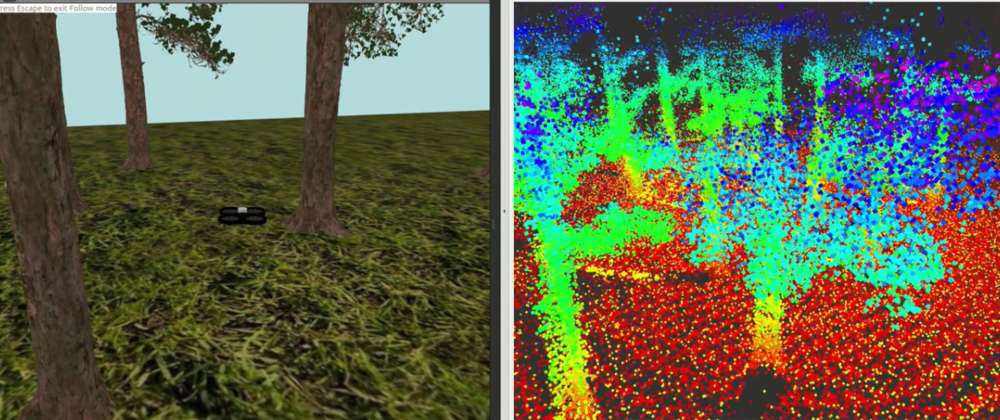

# 🌲 AURORA – Multi-UAV SAR System with LI-SLAM & FASTLIO2

Welcome to **AURORA** – a modular, simulation-ready, multi-UAV system for **Search and Rescue (SAR)** in complex **forest environments**. Developed at **Habib University** as a final-year Capstone Project, AURORA integrates cutting-edge SLAM, path planning, and human detection technologies under one unified framework.

Built with **ROS2 (Humble)**, **Gazebo Classic**, and real-time LiDAR-thermal SLAM pipelines, AURORA is purpose-designed for GPS-denied, under-canopy scenarios where traditional SAR efforts struggle.

---

## 📺 Demo Video

See AURORA in action – live mapping, autonomous flight, and human detection in a simulated dense forest:

[](https://youtu.be/zFVc0A3nOic)

---

## 📖 Table of Contents

- [Overview](#overview)
- [Key Contributions](#key-contributions)
- [System Features](#system-features)
- [Architecture Overview](#architecture-overview)
- [Key Packages](#key-packages)
- [Acknowledgements](#acknowledgements)
- [Getting Started](#getting-started)
- [Installation](#installation)
- [Usage](#usage)
- [Changing Gazebo Worlds](#changing-gazebo-worlds)
- [People](#people)

---

## 🧭 Overview

**AURORA** addresses the core challenges of forest SAR operations:

- 🚫 GPS-denied conditions  
- 🌲 Occlusion from canopy and dense vegetation  
- ⚠️ Visual aliasing and unreliable communication

Our system leverages **LiDAR, IMU, and thermal cameras** mounted on UAVs to enable:

- Real-time **Simultaneous Localization and Mapping (SLAM)**  
- **Thermal-aware exploration** and victim detection  
- Multi-agent **autonomous navigation** and **teleoperation** support

---

## 🚀 Key Contributions

- ✅ First complete benchmarked SAR pipeline for forest environments  
- 🔁 Evaluation of **LI-SLAM** vs. **FASTLIO2** under identical testbeds  
- 🔥 Integration of thermal human detection via benchmarking of various nano and small variants of YOLOv8 through YOLOv12  
- 📡 Autonomous and operator-assisted mission architecture  
- 📊 Field-oriented performance benchmarking (exploration speed, SLAM RMSE, detection accuracy, detection success etc.)

---

## ⚙️ System Features

- 🛰️ Multi-UAV, ROS2-based architecture  
- 🗺️ Real-time mapping using LiDAR-Inertial odometry  
- 🔍 Frontier and probability-map exploration algorithms  
- 🔥 YOLO-based thermal human detection  
- 🧭 Path planning with RRT/bi-RRT + APF for collision-free movement 
- 📍 Victim localization with ≤5m accuracy

---

## 🧱 Architecture Overview

**Base Station:**
- Mission planning
- Operator interface (RViz2)
- Real-time visualization

**UAV Stack:**
- SLAM: LI-SLAM / FASTLIO2
- Exploration logic
- Target detection module (YOLO + Thermal)
- 3D Path Planner
- Motion Module

---

## 📦 Key Packages

1. **SJTU Drone** – UAV model, control interfaces, and world setup  
2. **LI-SLAM** – Pose-graph based SLAM for dense environments  
3. **FASTLIO2** – Real-time, tightly coupled LiDAR-Inertial odometry
4. **Octomap** - Popular volumetric representation of obstacles and free-space
5. **Open-Motion-Path-Planning Library** – For 3D path planning
6. **Human Detection** – YOLOv8, trained on thermal forest imagery
7. **Local APF-based reactive planner** - For avoiding obstacles partially mapped by the LiDAR

---

## 🙏 Acknowledgements

- [SJTU Drone (Parrot AR2)](https://github.com/NovoG93/sjtu_drone) – by Shanghai Jiao Tong University  
- [LI-SLAM ROS2](https://github.com/rsasaki0109/li_slam_ros2) – by Ryuhei Sasaki  
- [FASTLIO2 ROS2](https://github.com/hku-mars/FAST_LIO/tree/ROS2) – by HKU-MARS Lab  
- Advised by **Dr. Abdul Basit Memon**, Habib University

---

## 🛠️ Getting Started

### Prerequisites

- ROS2 Humble
- Gazebo Classic 11
- Python 3.8+
- C++ compiler (for ROS nodes)
- [Gazebo Models Download (Google Drive)](https://drive.google.com/drive/folders/1m94-q4EyJTxHPq3p_1vGZ0i0HHRN0Vhf)

### Clone the Repository

```bash
git clone https://github.com/ShameerMasroor/Aurora-Multi-UAV-System-for-Forest-Search-and-Rescue.git

```

---

## 🛠️ Installation

- Assuming that you have ROS2 Humble and Gazebo Classic 11 installed, install the following libraries
  
```bash
sudo apt update && sudo apt install -y \
  terminator \
  tzdata


```

- Installing package dependencies

```bash
sudo apt update && sudo apt install -y \
  ros-humble-xacro \
  ros-humble-joint-state-publisher \
  ros-humble-pcl-ros \
  ros-humble-octomap-msgs \
  ros-humble-tf-transformations \
  ros-humble-gazebo-ros-pkgs \
  ros-humble-gazebo-ros2-control \
  ros-humble-gazebo-plugins \
  python3-colcon-common-extensions \
  xterm \
  libompl-dev && \
pip install ultralytics supervision

```

- Uninstalling the pre-installed ROS2 OMPL library and installing from source

```bash
sudo apt remove -y libompl-dev ros-humble-ompl
sudo apt update && sudo apt install -y \
  cmake \
  pkg-config \
  libboost-all-dev \
  python3-dev \
  python3-pybind11 \
  python3-numpy \
  libeigen3-dev

git clone https://github.com/ompl/ompl.git -b 1.6.0 --depth 1
cd ompl

mkdir -p build/Release
cd build/Release
cmake ../.. -DCMAKE_BUILD_TYPE=Release -DPYTHON_EXEC=/usr/bin/python3
make -j$(nproc)
sudo make install


```
